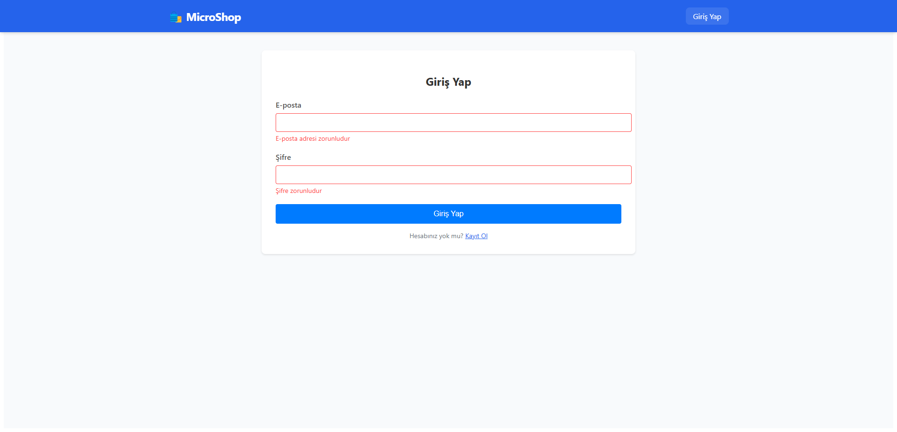
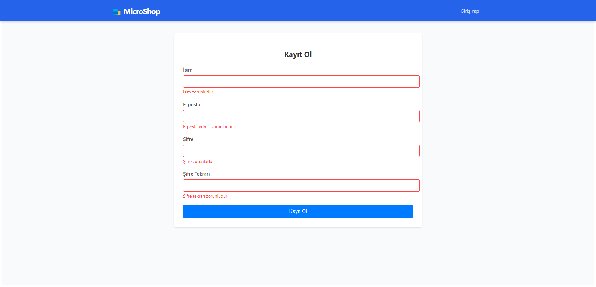
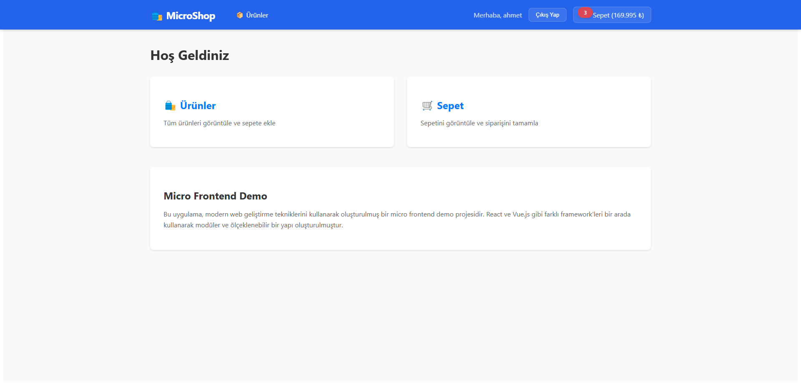
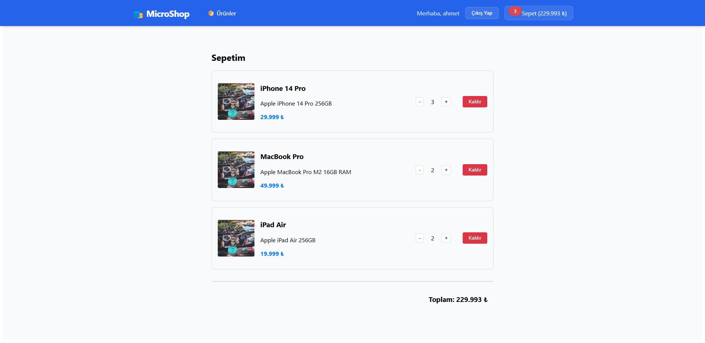

# Mikro Frontend E-Ticaret Uygulaması

Bu proje, modern web geliştirme tekniklerini kullanarak oluşturulmuş bir mikro frontend mimarisi örneğidir. Farklı frontend framework'lerini (React ve Vue.js) bir arada kullanarak modüler ve ölçeklenebilir bir e-ticaret uygulaması geliştirilmiştir.

## 🏗️ Proje Yapısı

Proje aşağıdaki mikro frontend'lerden oluşmaktadır:

- **Container (Ana Uygulama)**: React tabanlı ana uygulama (`localhost:3000`)
  - Diğer mikro frontend'leri birleştirir
  - Routing ve navigasyon yönetimi
  - Global durum yönetimi (sepet durumu)
  - Kullanıcı oturum yönetimi

- **Products (Ürünler)**: React tabanlı ürün listesi uygulaması
  - Ürün kataloğu görüntüleme
  - Ürün detayları
  - Sepete ekleme fonksiyonalitesi

- **Cart (Sepet)**: Vue.js tabanlı sepet uygulaması
  - Sepet içeriği görüntüleme
  - Ürün miktarı güncelleme
  - Ürün kaldırma (onay modali ile)
  - Toplam fiyat hesaplama

- **Auth (Kimlik Doğrulama)**: React tabanlı auth uygulaması
  - Kullanıcı girişi
  - Kullanıcı kaydı
  - Oturum yönetimi
  - Korumalı rotalar

- **Backend**: JSON Server tabanlı mock API (`localhost:3004`)
  - Ürün ve sepet verilerinin yönetimi
  - Kullanıcı verilerinin yönetimi
  - RESTful API endpoints

## 🚀 Başlangıç

1. Bağımlılıkları yükleyin:
   ```bash
   pnpm install
   ```

2. Backend servisini başlatın:
   ```bash
   pnpm run server
   ```

3. Mikro frontend'leri başlatın:
   ```bash
   # Container
   cd container
   pnpm start

   # Products
   cd remote1-products
   pnpm start

   # Cart
   cd remote2-cart
   pnpm start

   # Auth
   cd remote3-auth
   pnpm start
   ```

## 🛠️ Teknolojiler

- **Frontend**:
  - React 18
  - Vue.js 3
  - TypeScript
  - React Router
  - Module Federation
  - Webpack 5
  - React Toastify
  - Vue Toastification
  - Formik & Yup

- **Backend**:
  - JSON Server
  - RESTful API

## 🔄 İletişim Mekanizması

Mikro frontend'ler arası iletişim aşağıdaki yöntemlerle sağlanmaktadır:

1. **Custom Events**: 
   - Sepet güncellemeleri
   - Kullanıcı oturum durumu değişiklikleri
2. **Module Federation**: Mikro frontend'lerin paylaşımı
3. **Context API**: Auth durumu yönetimi
4. **REST API**: Veri yönetimi

## 📦 Proje Yapılandırması

```
micro-frontend-cursor/
├── container/           # Ana uygulama (React)
├── remote1-products/    # Ürünler uygulaması (React)
├── remote2-cart/        # Sepet uygulaması (Vue.js)
├── remote3-auth/        # Kimlik doğrulama uygulaması (React)
├── shared-ui/          # Paylaşılan UI bileşenleri
└── server/             # Mock API (JSON Server)
```

## 🌟 Özellikler

- Modern ve responsive tasarım
- Mikro frontend mimarisi
- Framework-agnostic yapı
- Gerçek zamanlı sepet güncellemeleri
- TypeScript ile tip güvenliği
- Modüler ve ölçeklenebilir mimari
- Kullanıcı kimlik doğrulama sistemi
- Korumalı rotalar
- Sepet işlemleri için onay modalleri
- Kullanıcı dostu bildirimler
- Ürün miktarı yönetimi
- Dinamik fiyat hesaplaması

## 🔒 Güvenlik Özellikleri

- Korumalı rotalar ile yetkisiz erişim engelleme
- Oturum yönetimi
- Güvenli form doğrulama
- İşlem onayları
- Hata yönetimi ve kullanıcı bildirimleri

## 📸 Ekran Görüntüleri

### Kimlik Doğrulama

*Kullanıcı giriş ekranı*


*Yeni kullanıcı kayıt ekranı*

### Ana Sayfa ve Ürünler

*Dashboard ekranı ve ürün kartları*

### Ürün Listesi

*Ürün listesi ve sepete ekleme işlemleri*

### Sepet İşlemleri

*Sepet içeriği ve miktar kontrolleri*

## 🤝 Katkıda Bulunma

1. Bu repo'yu fork edin
2. Yeni bir branch oluşturun (`git checkout -b feature/amazing-feature`)
3. Değişikliklerinizi commit edin (`git commit -m 'feat: Add amazing feature'`)
4. Branch'inizi push edin (`git push origin feature/amazing-feature`)
5. Bir Pull Request oluşturun
